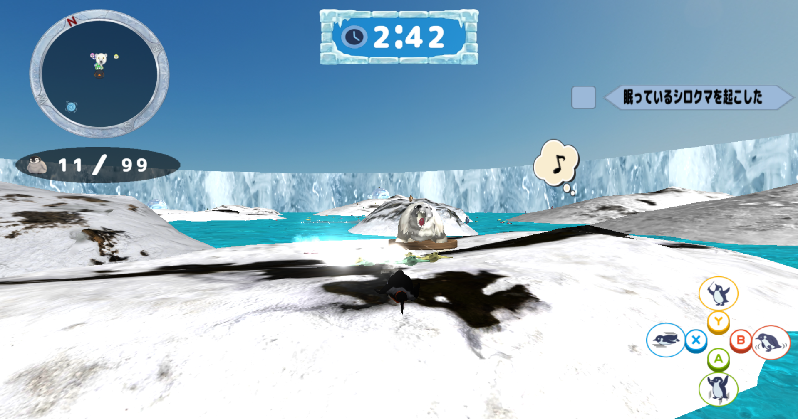
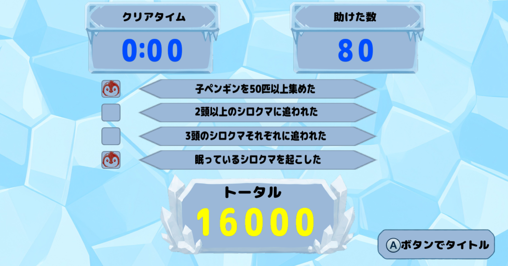
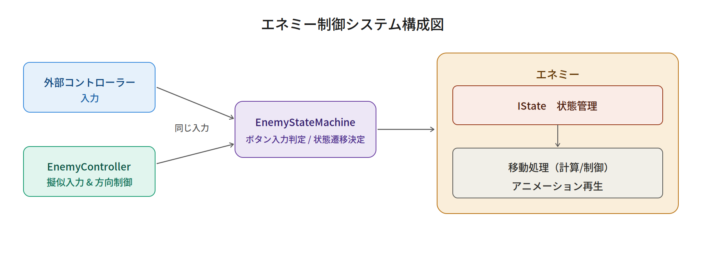
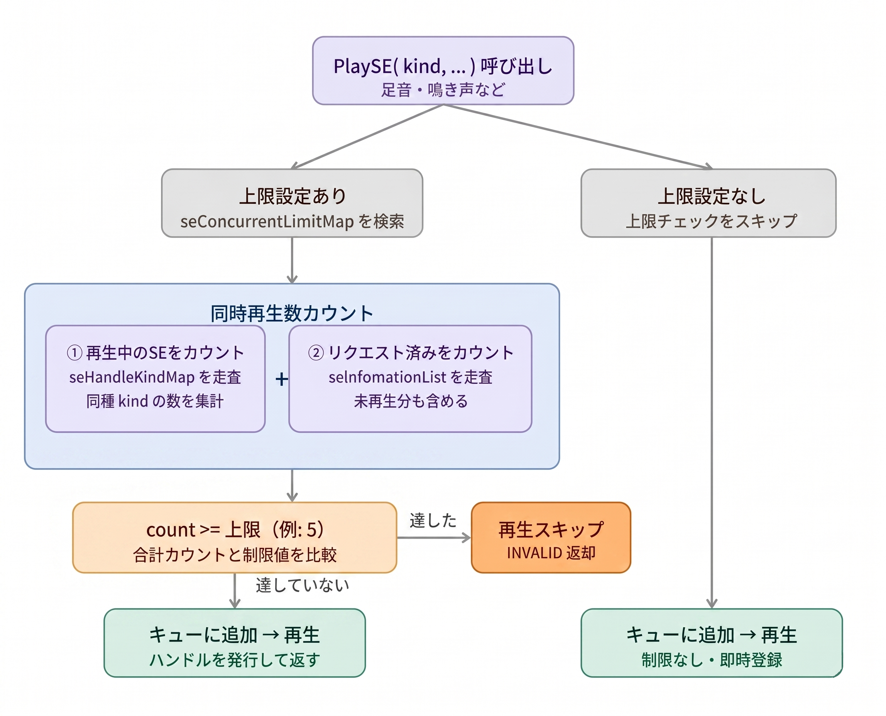
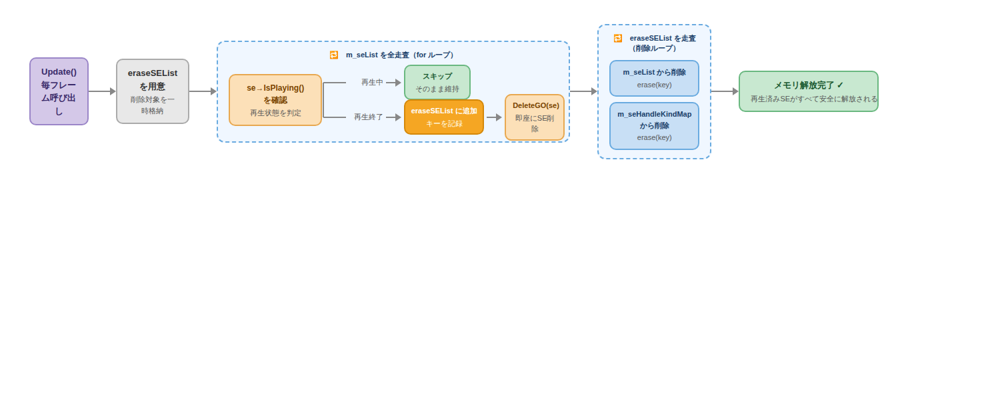

<link rel="stylesheet" href="style.css">

# ゲームプログラマー ポートフォリオ

## 目次

- [自己紹介](#自己紹介)
- [作品概要](#作品概要)
- [ゲーム紹介](#ゲーム紹介)
- [担当箇所](#担当箇所)
   - [エネミーAI・ステートマシン](#エネミーaiステートマシン)
   - [かまくら（インタラクトと動的破壊ギミック）](#かまくらインタラクトと動的破壊ギミック)
   - [ゲーム用基底クラス IObject の設計・実装](#ゲーム用基底クラス-iobject-の設計実装)
   - [アチーブメント達成通知アニメーション](#アチーブメント達成通知アニメーション)
   - [サウンドマネージャー（SoundManager）](#サウンドマネージャーsoundmanager)
   - [アプリケーションクラス](#アプリケーションクラス)
   - [フェードシステム](#フェードシステム)
<br><br><br><br>

## 自己紹介


### ■ 名前
&emsp;&emsp;&emsp;**立山 虎太朗　(たちやま こたろう)** 


### ■ 学校
&emsp;&emsp;&emsp;**河原電子ビジネス専門学校　ゲームクリエイター科**
### ■ メール
&emsp;&emsp;&emsp;ca01254014@st.kawahara.ac.jp

### ■ 自分の強み（長所）
的確な仕様把握に基づく、効率的なアーキテクチャの設計・実装力<br>
私は「いかに無駄なく手戻りを防ぐか」を徹底し、事前に仕様を完璧に把握した上で最適なプログラムを構築する強みを持っています。<br>
手作業の手間を排除する効率的な仕組みづくりを得意としており、実際の制作でも、自動ガベージコレクションの導入やStatic関数を用いたメモリ節約設計など、破綻しにくく効率的なシステムを自ら設計・具現化しました。

### ■ 趣味・休日の過ごし方
休日は、漫画を読んだりゲームをプレイしたりして過ごしています。<br>
最近は国内外の大自然を紹介する動画を観るのにはまっており、美しい景色や環境に触れて心をリフレッシュさせる時間が心地よい息抜きになっています。<br>
プライベートでしっかり感性を刺激し、オンとオフの切り替えを行うことが、平日の高い開発パフォーマンスや要領の良いタスク完遂へと繋がっています。

### ■ 好きなエンタメ
RPG・アクションゲーム（特に国内外のトレンドや「メトロイドヴァニア」）
普段からRPGやアクションゲームを好んでプレイしており、最近は『プラグマタ』や『コードヴェイン』、卓越した操作性を持つ『セレステ』などに触れました。<br>
中でも、特に海外のインディーシーンで熱狂的な人気を誇る「メトロイドヴァニア」というジャンルに強い関心を持っています。<br>
直近では海外発の『ホロウナイト：シルクソング』をプレイし、その洗練されたレベルデザインを体感しました。<br>
世界中で愛されるこのジャンルを深く分析・研究することは、グローバルなゲーム事情やトレンドを掴むきっかけになっており、自身の開発における演出やギミックの引き出しを広げることにも繋がっています。

<br><br><br><br>

## 作品概要
| 項目 | 内容 |
| :--- | :--- |
| タイトル | ぺんたくと |
| 制作人数 | 4人 |
| 製作期間 | 2025年4月～現在 |
| ゲームジャンル | 3Dアクションゲーム |
| プレイ人数 | 1 |
| 対応ハード | PC (Windows 11) / Xbox コントローラー |
| 使用言語 | C++ |
| エンジン | BeastEngine（学校内製エンジン（k2EngineLow） / DirectX12） |
| 使用ツール | Visual Studio 2026<br>Visual Studio Code<br>Adobe Photoshop 2026<br>3dsMax 2026<br>Effekseer<br>GitHub<br>Fork |
| GitHub URL | https://github.com/TakebayashiNaoya/ProjectBeast |
---
<!-- <hr style="width: 300px; margin-left: 0;"> -->


<br><br><br><br>

---

## ゲーム紹介

「たくさん救いたい、でも見つかりたくない！」天敵の猛追を切り抜ける、ハイリスク・ハイリターンな3Dアクション！<br>
本作は、親ペンギンを操作し、制限時間内にフィールド上にはぐれた子ペンギンたちを救出してハイスコアを目指す3Dアクションゲームです。<br>
【本作のウリ：可愛さと煩わしさが生むジレンマ】救出した子ペンギンたちは親の後ろをゾロゾロとついてきます。集めるほどに見ためは愛らしくなりますが、天敵「シロクマ」に見つかるリスクや、引き連れる煩わしさ（コントロールの難しさ）が増大していきます。<br>
【ハイスコアを狙う、スリリングなアチーブメントシステム】単に逃げるだけでなく、「あえて眠っているシロクマを起こす」「複数頭のシロクマにあえて追われる」といった、危険な条件（アチーブメント）を達成するほどスコアが跳ね上がります。<br>
安全地帯である「かまくら」すらもシロクマに破壊される極限状態の中、極限の「欲」と「割り切り」の立ち回りが試されるゲームです。<br><br>
<br>



<br><br><br><br>

---

## 担当箇所


<summary><span style="font-size: 1.2em; font-weight: bold;">Source</span></summary>
<ul>
	<li><code>application.h</code> / <code>.cpp</code></li>
<summary><span style="font-size: 1.2em; font-weight: bold;">Core</span></summary>
<ul>
<li><code>Fade.h</code> / <code>.cpp</code></li>
</ul>
  <summary><span style="font-size: 1.2em; font-weight: bold;">Enemy</span></summary>
  <ul>
    <li><code>Enemy.h</code> / <code>.cpp</code></li>
    <li><code>EnemyController.h</code> / <code>.cpp</code></li>
    <li><code>EnemyIState.h</code> / <code>.cpp</code></li>
    <li><code>EnemyParameter.h</code> / <code>.cpp</code></li>
    <li><code>EnemyStateMachine.h</code> / <code>.cpp</code></li>
    <li><code>EnemyStatus.h</code> / <code>.cpp</code></li>
    <li><code>EnemyTypes.h</code> / <code>.cpp</code></li>
  </ul>

<summary><span style="font-size: 1.2em; font-weight: bold;">Manager</span></summary>
<ul>
<li><code>IglooManager.h</code> / <code>.cpp</code></li>
</ul>

 <summary><span style="font-size: 1.2em; font-weight: bold;">Sound</span></summary>
 <ul>
 <li><code>SoundManager.h</code> / <code>.cpp</code></li>
 <li><code>Types.h</code> / <code>.cpp</code></li>
 </ul>
<summary><span style="font-size: 1.2em; font-weight: bold;">UI</span></summary>
<ul>
<summary><span style="font-size: 1.2em; font-weight: bold;">Menus</span></summary>
<ul>
<li><code>AchievementNotificationMenu.h</code> / <code>.cpp</code></li>
<li><code>InGameButtonMenu.h</code> / <code>.cpp</code></li>
</ul>
<summary><span style="font-size: 1.2em; font-weight: bold;">Model</span></summary>
<ul>
<li><code>AchievementAnimStatus.h</code> / <code>.cpp</code></li>
</ul>


</ul>

<li><code>IObject.h</code> / <code>.cpp</code></li>


<br><br><br><br>

## エネミーAI・ステートマシン


プレイヤーと子ペンギンに「執拗に追われる緊迫感」を与えるため、視覚・聴覚による索敵と、破綻のない滑らかな状態遷移を実現する自律行動AIを実装しました。

### Stateパターンによる状態管理の堅牢化
エネミーは「待機・索敵・追跡・攻撃・睡眠…」など多くの状態を持つため、当初はifやswitchで状態を分岐させていましたが、状態が増えるにつれてコードが肥大化し、「ある状態のときだけ起きるバグ」の原因特定が困難になっていきました。
そこでデザインパターンを調べたところ、Stateパターンが状態ごとに処理を独立したクラスへ分離できる点で最適だとわかり、採用しました。<br>
**EnemyIdleState　/　EnemyChaseState　/　EnemyAttackState　…（各状態が独立したクラス）**<br>
各ステートクラスは Enter / Update / Exit のみを責務として持ち、他の状態の処理に絶対に干渉しない構造になっています。これにより「攻撃ステートを修正したら索敵が壊れた」といった意図しない影響が起きにくくなり、バグの調査・修正がステートクラス単位で完結するようになりました。また、新しい状態を追加する際も既存のクラスに手を加えずクラスを1つ追加するだけで済み、チーム開発での安全な機能拡張にも貢献しています。

### Static関数・Static変数による共有メモリ設計
各ステートの Enter / Update / Exit / Check の処理は、すべて static 関数として定義しています。これらの関数ポインタは static な std::map（状態テーブル）に1度だけ登録されるため、エネミーが何体同時に存在しても、AIロジック自体はメモリ上に1つしか存在しません。
各インスタンスが個別に保持するのは「現在のステートID」などの最小限のデータだけに抑えており、エネミーの数が増えてもメモリ使用量を低く維持できる設計にしています。

### コントローラーの分離設計（AIの汎用化）
AI用の処理（入力や判断）と、キャラクターの動作（移動やアニメーション）を密結合させず、別の処理として分離して設計しています。
この考え方により、エネミー専用の処理にとどまらず、**将来的には他のキャラクターやNPC、あるいはプレイヤー入力でも操作を差し替えられるような汎用性の高い構造**を実現しています。
<br>


### スタック（停滞）の自動検知と復帰
徘徊や帰巣の際、地形に引っかかって数秒間移動できなかった場合（スタック）を検知するタイマーを実装しました。自動で次の巡回ポイントへ移行、または入力をリセットすることで、AIの進行不能バグを未然に防いでいます。

### レイキャスト判定と音による動的索敵
視界の遮蔽判定には、スフィアキャスト（球状キャスト）などではなく、処理負荷の軽いRaycast（線分キャスト）を採用しました。
Raycastは小さな隙間をすり抜けてしまう弱点もありますが、**本作のレベルデザインやゲーム性においては問題ないと判断し、パフォーマンス（軽さ）を優先した設計**にしています。
さらに、`NoiseManager`と連携し、プレイヤーが立てた音の大きさが閾値を超えた場合にその座標へ向かって歩き出すなど、動的でメリハリのある索敵処理を実装しています。


<br><br><br><br>


## かまくら（インタラクトと動的破壊ギミック）


ペンギンの避難所となる「かまくら」の管理と、エネミーによる破壊ギミックを実装しました。
安全地帯の役割をUIで直感的に伝えつつ、それがエネミーに破壊される絶望感を、視覚・聴覚の同期によって最大化しています。

### アニメーションとロジックの完全同期（ステートとAI制御の連携設計）
エネミーの攻撃時、単なる距離判定でかまくらを壊すのではなく、アニメーションの**「叩きつけフレーム」の瞬間にのみ破壊処理が走る**ように設計しています。
具体的なプログラムの構造として、以下のような役割分担を行っています。
1. **状態管理（IState）**：攻撃ステート側で時間を計測し、叩きつけの瞬間に1度だけ「攻撃実行フラグ」を立てる。
2. **AI制御（Controller）**：AI側で毎フレーム監視を行い、フラグが立っていたら**即座にフラグを折って（二重実行を防止）**破壊処理を実行する。

さらに、攻撃開始の段階で「ターゲットがかまくらの中にいるか」「どのかまくらか（識別キー）」を事前に検索・記憶（キャッシュ）しておくことで、叩きつけの瞬間に余計な検索負荷をかけず、安全かつ確実に破壊（`BreakIgloo`）を実行できる設計にしています。

### 安全なオブジェクト破棄
破壊時には当たり判定の無効化、非表示化、そしてメモリ上からの安全な削除を即座に行い、同時に中のペンギンを強制排出する一連のフローを安全に構築しています。

<br><br><br><br>


## ゲーム用基底クラス IObject の設計・実装

ゲーム内に登場するオブジェクトの根幹となる基底クラス `IObject` を独自に設計および実装しました。

### 実装の経緯と意図
既存のフレームワークに用意されていた `IGameObject` にブラックボックスとして依存するのではなく、オブジェクトの生成から更新、描画、破棄までのライフサイクル処理を**自分たちの手で1から構築し、内部構造への深い理解と最適化を図るため**に作成しました。

### データ駆動とメモリの安全性
- **共通インターフェースの確立**：派生クラスが共通して持つべき機能（初期化、更新、描画など）を仮想関数として定義し、ポリモーフィズムを活用した拡張性の高いアーキテクチャの基盤を作りました。
- **一元管理**：マネージャーからこの基底クラスのポインタを通して一括更新・一括破棄を行える仕組みを構築。コンテナのメモリを事前確保することで、動的生成されるオブジェクト群のメモリリークや処理落ちを防いでいます。




<br><br><br><br>


## アチーブメント達成通知アニメーション


特定条件を満たした際に、画面端にダイナミックに表示される実績解除通知UIを実装しました。
プレイの達成感を高め、手触りの良いリッチなゲーム体験（ゲーム感）を提供することを目的としています。

### キュー（Queue）によるUI衝突防止
複数の実績が同時に解除された際、UIが重なって表示されるバグを防ぐため、待ち行列システムを実装しました。1つの通知アニメーションが完全に終了してから次を表示する安全な設計にしています。



### ステートによるタイムライン制御
UIの表示状態を `FadeIn -> StampWait -> StampPlay -> FadeOut` と厳密に状態管理しています。フェード完了後に1秒待ってスタンプを押すなど、心地よい手触りの演出時間を正確に制御しました。

<br><br><br><br>


## サウンドマネージャー（SoundManager）

BGM、SE、Voiceの再生、停止、音量を集中統括するシングルトンマネージャーを実装しました。

### 発音数（同時再生数）の厳格な制限
キャラクター数が多い本作において、足音などが同時に大量発生して音が割れたり処理落ちが発生したりするのを防ぐため、**サウンドの発音数を厳密に管理**しています。
特定のSEに対して「最大5音まで」といった発音数の上限を設定し、リクエスト時にカウントを行い、上限を超えた場合は自動でスキップする仕組みです。

<span style="font-size: 0.9em; color: #666;">
※上限「5音」の根拠：自身での検証および第三者への試遊テストを経て、ゲームプレイの状況把握に支障が出ず、かつ音が飽和してうるさく感じられない最適な音数として導き出しました。なお、この数値は多くのSEでベースとして採用している代表値であり、効果音の種類や重要度に応じて個別に上限を設定しています。
</span>

<br>


### 自動ガベージコレクション
毎フレームの更新処理にて、再生が終了したオーディオソースを自動検知してメモリから解放し、メモリリークを徹底的に防ぐ設計にしています。
```cpp
/** SEリストから再生していないものがあれば削除する */
std::vector<SEHandle> eraseSEList;
for (auto& it : m_seList) {
	const auto key = it.first;
	auto* se = it.second;
	if (!se->IsPlaying()) {
		eraseSEList.push_back(key);
		DeleteGO(se);
	}
}
for (const auto& key : eraseSEList) {
	m_seList.erase(key);
	m_seHandleKindMap.erase(key);
}
```


## アプリケーションクラス

ゲームのメインループと、各種マネージャーのライフサイクルを一元管理する `Application` クラスを実装しました。

### チーム開発のための管理基盤（存在意義）
既存のシステムに処理を任せきりにするのではなく、**「自分たちでゲーム全体の処理フロー（初期化・更新・描画・破棄）を完全に統制・把握しやすくするため」**に、アプリケーションの根幹となる独立した管理クラスを用意しました。
コンストラクタで各種マネージャーのインスタンス化を実行し、デストラクタでは**その逆順で確実に破棄・解放処理を実行**しています。
システムや機能が今後どれだけ拡張されても、このクラスを見れば全体の実行順序や依存関係が一目で把握できるように設計し、マネージャー間の解放順の狂いによるダングリングポインタなどの重大なエラーを構造的に防止しました。
```cpp
Application::Application()
{
	nsBeastEngine::nsCollision::PhysicsWorld::Initialize();
	nsBeastEngine::OcclusionDitherManager::Initialize();
	camera::CameraManager::CreateInstance();
	core::ParameterManager::CreateInstance();
	core::Fade::Create();
	SoundManager::CreateInstance();
	NoiseManager::CreateInstance();
	SceneManager::CreateInstance();
	EffectManager::CreateInstance();
}

Application::~Application()
{
	SceneManager::DestroyInstance();
	NoiseManager::DestroyInstance();
	SoundManager::DestroyInstance();
	EffectManager::DestroyInstance();
	camera::CameraManager::DestroyInstance();
	core::ParameterManager::DestroyInstance();
	core::Fade::Delete();
	nsBeastEngine::nsCollision::PhysicsWorld::Finalize();
	nsBeastEngine::OcclusionDitherManager::Finalize();
}
```
<br><br><br><br>

## フェードシステム


シーンが切り替わる際のロード画面のフェードイン・フェードアウト処理を統括するシステムを実装しました。

### 画面のフリーズ感払拭と遅延初期化
シーン遷移のデータロード中にゲーム画面がブツ切りになったり、完全に静止してプレイヤーにストレスを与えたりする違和感を無くすために導入しました。
アプリケーション起動時の初期化負荷を分散させるため、ローディングサークルのスプライト生成には遅延初期化（Lazy Initialization）を採用し、初回呼び出し時にのみメモリを確保する設計にしています。

### フレームレートに依存しない滑らかな演出
データロードによる高負荷で処理落ち（フレームレートの低下）が発生した場合でも、ロード中の演出速度が乱れない工夫を施しています。
前フレームからの経過時間（DeltaTime）を回転の計算に乗算することで、**フレームレートの変動に影響されず、ローディングサークルが常に滑らかに一定速度で回転し続ける仕様**を実現し、製品クオリティのユーザー体験を維持しました。<br><br><br><br>
[目次に戻る](#目次)